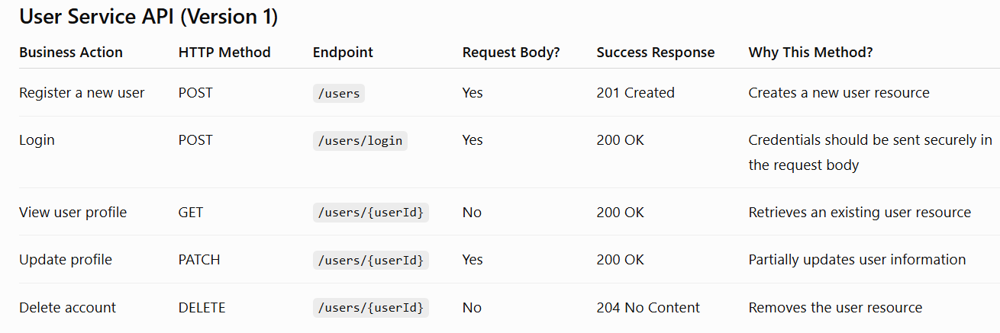

# Mini E-commerce platform: A cloud-native microservices platform 

## 1. Objective

To develop a cloud-native e-commerce platform using a microservices architecture to demonstrate modern cloud computing concepts including containerization with Docker, orchestration with Kubernetes, CI/CD automation using GitHub Actions, and deployment on AWS.

The focus of this project is not the complexity of the business logic but the design, deployment, scalability, and maintainability of distributed services.

## 2. Architecture
user --> frontend service --> http/https requests --> api gateway --> 
user service, product service and order service having their own databases 

I built a cloud-native e-commerce platform using microservices. I containerized each service, orchestrated them with Kubernetes, automated deployments with CI/CD, and deployed the application to AWS.

## 3. USER SERVICE

